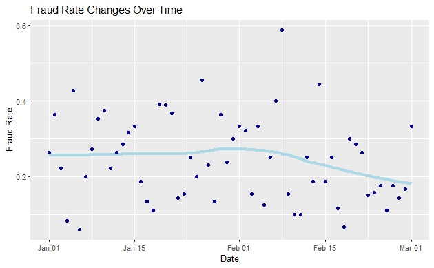
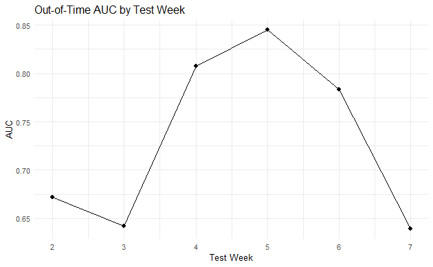

# Fraud Detection Under Temporal Non-Stationarity

## Executive Summary

This project investigates how temporal non-stationarity impacts fraud prediction performance in an insurance claims dataset spanning eight weeks.

While multiple predictive models (Logistic Regression, LASSO, and XGBoost) achieved reasonable validation performance, all experienced significant deterioration on the forward test set. The primary driver was temporal drift in fraud prevalence and feature distributions.

The analysis demonstrates that model sophistication alone does not solve performance decay under evolving fraud behaviour. Instead, adaptive retraining and dynamic threshold calibration are required.

---

## Business Problem

Insurance fraud creates material financial and operational risk. Predictive modelling enables prioritisation of suspicious claims for investigation.

However, most modelling frameworks assume stationarity, that the statistical relationship between predictors and fraud remains stable over time.

This project evaluates whether that assumption holds, and if not, how modelling strategy must adapt.

---

## Data Overview

- 8 weeks of insurance claims data
- Binary fraud outcome
- Policy, claim, and vehicle-level features
- Temporal split into training, validation, and test sets

Observed fraud prevalence:
- Training: 26.7%
- Test: 18.6%

This shift alone suggests potential instability in model calibration.

---

## Methodology

Models implemented:

- Logistic Regression
- LASSO-Regularised Logistic Regression
- XGBoost (Gradient Boosted Trees)

Key analytical extensions:

- Forward test evaluation (true out-of-time testing)
- Rolling window retraining
- Expanding window retraining
- Calibration diagnostics
- Threshold sensitivity analysis

Model performance was assessed using AUC, confusion matrices, and stability of predicted probabilities across time.

---

## Key Findings

## 1. Significant Temporal Drift

Fraud prevalence and key feature distributions shifted between periods.

<p align="center">
  
</p>

---

## 2. Feature Distribution Shift (PSI)

Key predictors such as claim-to-premium ratio exhibit distributional differences between training and test sets. This covariate drift reduces the stability of learned relationships.

---

## 3. Performance Deterioration

All models exhibited meaningful drops in AUC and calibration quality on forward test data.

---

## 4. Rolling Window Superiority

A 4-week rolling training window produced the most stable predictive performance.

<p align="center">
  
</p>

---

### 5. Threshold Instability

Fixed decision thresholds were not robust to base-rate changes.

<p align="center">
  
</p>

---
## Practical Implications

- Fraud detection systems require frequent retraining.
- Thresholds should be recalibrated dynamically.
- Monitoring for data drift is essential.
- Operational separation between scoring and decision rules improves flexibility.

Static historical models are insufficient in environments with evolving behavioural patterns.

---

## Repository Structure

```
fraud-detection-nonstationarity/
│
├── fraud_analysis.Rmd
├── fraud_analysis.pdf
├── figures/
└── README.md
```

---

## Technical Skills Demonstrated

- Predictive Modelling
- Regularisation (LASSO)
- Gradient Boosting (XGBoost)
- Time-Based Cross Validation
- Model Calibration Analysis
- Drift Diagnostics
- Business Translation of Statistical Results

---

## Extensions

Future work could incorporate:

- Online learning frameworks
- Explicit concept drift detection algorithms
- Cost-sensitive optimisation aligned to investigation budgets
- Bayesian updating of fraud prevalence

---
